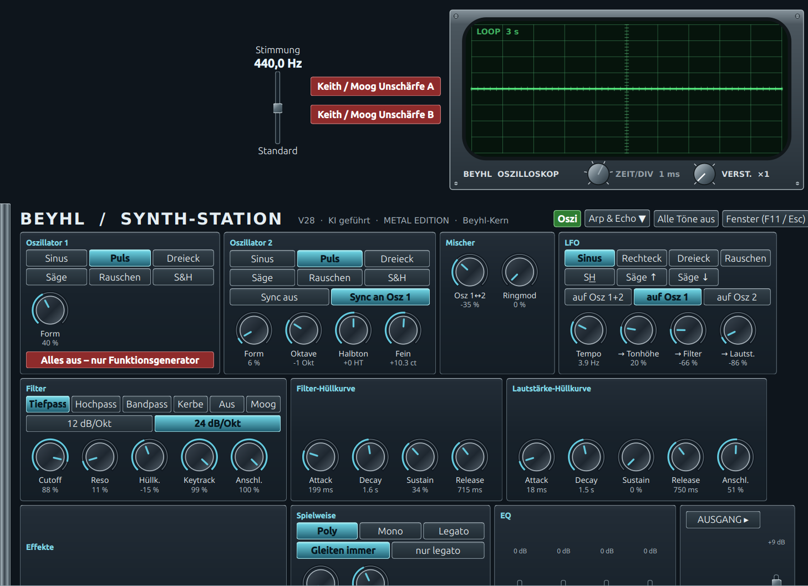

# Beyhl Synth-Station

Ein Synthesizer für Linux und Windows mit eigenem Klangerzeuger („Beyhl-Kern“) und großer Bedienoberfläche,
entwickelt von Klaus Beyhl (Beyhl Software) zusammen mit Claude Opus 5.5. Kostenlos.

## ⬇ Herunterladen

**[⬇ Für Linux](https://github.com/SualkKlaus/Beyhl-Synth-Station/releases/latest/download/Beyhl-Synth-Station-Linux)**

**[⬇ Für Windows](https://github.com/SualkKlaus/Beyhl-Synth-Station/releases/latest/download/Beyhl-Synth-Station-Windows.exe)**

**[⬇ Klangbänke (amsynth, GPL 2)](https://github.com/SualkKlaus/Beyhl-Synth-Station/releases/latest/download/Klangbaenke-amsynth.zip)** – Zip entpacken und alle .bank-Dateien **einzeln direkt neben das Programm** in denselben Ordner legen. Eine Zip oder ein Unterordner wird nicht gelesen.

## Video

[Video auf YouTube](https://www.youtube.com/watch?v=G9VVlh5ALDQ)

## Was er kann

- Eigener Klangkern: 2 Oszillatoren plus LFO, Filter mit Moog-Kaskade, Hüllkurven mit Kondensator-Verlauf
- Studio-Effekte direkt im Kern: Chorus, Studio-Hall mit 7 Räumen, Echo, 4-Band-EQ
- Arpeggiator mit fertigen Werks-Mustern, 30 Szenen, Oszilloskop, Grundstimmung 415–466 Hz, KI-Steuerung
- Spielbar über jedes MIDI-Keyboard oder die Bildschirm-Klaviatur

## Starten

**Linux:** Datei in einen eigenen Ordner legen, Rechtsklick → Eigenschaften → „Als Programm ausführen“ ankreuzen, per Doppelklick starten. Voraussetzung: 64-Bit-Linux, aktuelles System (z. B. Ubuntu 24.04 oder neuer).

**Windows:** Datei in einen eigenen Ordner legen und per Doppelklick starten. Warnt Windows vor einer unbekannten App: „Weitere Informationen“ → „Trotzdem ausführen“. Voraussetzung: 64-Bit-Windows.

## Erster Start – schnell zum Klang

Bank **BriansBank21** wählen, Klang **00 „OnTheBeach“**, dann **Key hold** auf On, **Arp** auf On und **Latch** auf On. Eine Taste drücken – der Synth spielt sofort und man hört, was er kann.

## Klangbänke

Unser Synthesizer ist so gebaut, dass er die Klangbänke von amsynth spielen kann – dem freien Software-Synthesizer von Nick Dowell (Dateien mit Endung .bank). An dieser Stelle danken wir Nick Dowell und allen Mitwirkenden von amsynth herzlich dafür, dass sie ihre Arbeit und ihre Klangbänke frei zur Verfügung stellen.
- Ist amsynth installiert, werden dessen Bänke automatisch benutzt.
- Sonst die Klangbänke-Zip von oben holen, entpacken und alle .bank-Dateien einzeln aus dem entpackten Ordner herausnehmen und direkt neben das Programm legen – beliebig viele, auch eigene. In einer Zip oder einem Unterordner findet das Programm sie nicht.
- Die Werksbänke gibt es oben unter „Klangbänke“ als Zip; Herkunft: https://github.com/amsynth/amsynth, Lizenz GNU GPL 2.

Eigene Arp-Muster und Szenen speichert das Programm in seinem Ordner.

## MIDI-Steuerung

**Linux und Windows:** Jedes MIDI-Keyboard oder -Steuergerät spielt den Synth; es erscheint oben bei den MIDI-Eingängen und wird dort eingeschaltet. Alle Regler sind per Controller (CC) steuerbar: Wert 0–127 fährt den Regler über seinen ganzen Bereich, Schalter springen in gleich großen Stufen, die Oberfläche bewegt sich sichtbar mit. Chorus, Studio-Hall, Echo, EQ und Arpeggiator sind nicht per CC steuerbar.

| CC | Regler | CC | Regler |
|---|---|---|---|
| 0 + Programmwechsel | Bank + Klang wählen | 1 | Modulationsrad = LFO → Tonhöhe |
| 7 | Gesamtlautstärke | 64 | Haltepedal |
| 10 | Panorama | Pitch Bend | Tonhöhe |
| 20 | Lautstärke-Hüllkurve Attack | 41 | LFO → Lautstärke |
| 21 | Lautstärke-Hüllkurve Decay | 42 | Mischer Ringmod |
| 22 | Lautstärke-Hüllkurve Sustain | 43 | Oszillator 1 Form |
| 23 | Lautstärke-Hüllkurve Release | 44 | Oszillator 2 Form |
| 24 | Oszillator 1 Wellenform (Sinus, Puls, Dreieck/Säge, Rauschen, S&H) | 45 | Synth-Hall Raum |
| 25 | Filter-Hüllkurve Attack | 46 | Synth-Hall Dämpfung |
| 26 | Filter-Hüllkurve Decay | 47 | Synth-Hall Anteil |
| 27 | Filter-Hüllkurve Sustain | 48 | Synth-Hall Breite |
| 28 | Filter-Hüllkurve Release | 49 | Verzerrung |
| 29 | Filter Resonanz | 50 | Oszillator 2 Sync (aus / an) |
| 30 | Filter Hüllkurven-Stärke | 51 | Portamento-Zeit |
| 31 | Filter Cutoff | 52 | Spielweise (Poly, Mono, Legato) |
| 32 | Oszillator 2 Feinstimmung | 53 | Oszillator 2 Halbton |
| 33 | Oszillator 2 Wellenform | 54 | Filtertyp (Tiefpass, Hochpass, Bandpass, Kerbe, Aus, Moog) |
| 34 | Lautstärke (wie CC 7) | 55 | Filter-Steilheit (12 / 24 dB/Okt) |
| 35 | LFO Tempo | 56 | LFO-Ziel (Osz 1+2, Osz 1, Osz 2) |
| 36 | LFO Wellenform (Sinus, Rechteck, Dreieck, Rauschen, S&H, Säge ↑, Säge ↓) | 57 | Filter Keytrack |
| 37 | Oszillator 2 Oktave | 58 | Filter Anschlag |
| 38 | Mischer Osz 1 ↔ 2 | 59 | Lautstärke Anschlag |
| 39 | LFO → Tonhöhe (wie CC 1) | 60 | Portamento-Art (immer / nur legato) |
| 40 | LFO → Filter | | |

**Windows:** Unter Windows kann ein MIDI-Gerät meist nur von einem Programm gleichzeitig benutzt werden; um den Synth aus einem anderen Musikprogramm anzusteuern, braucht man ein virtuelles MIDI-Kabel wie das kostenlose loopMIDI.

## Mit Cubase oder einer anderen DAW

Die Synth-Station ist ein eigenständiges Programm, kein VST-Plugin. In eine DAW (Musikprogramm wie Cubase, Reaper, Ableton, Studio One) bindet man sie über zwei Wege ein: Noten hin, Ton zurück.

**Windows – Noten hin:** Ein virtuelles MIDI-Kabel installieren, z. B. das kostenlose loopMIDI (von Tobias Erichsen); es legt einen Port „loopMIDI Port“ an. In der DAW die MIDI-Spur auf diesen Port ausgeben, in der Synth-Station den Port oben bei den MIDI-Eingängen einschalten. Noten und Reglerbewegungen (CC, siehe Tabelle oben) kommen dann aus der DAW.

**Windows – Ton zurück:** Der Synth spielt auf den Standard-Ausgang von Windows. Zum Aufnehmen entweder die Loopback-Funktion der Soundkarte nutzen (viele Audio-Interfaces haben sie, z. B. die Steinberg-UR-Serie in dspMixFx) – dann liegt alles, was Windows abspielt, auf einem Aufnahme-Eingang –, oder ein virtuelles Audiokabel (z. B. das kostenlose VB-Cable) als Windows-Standard-Ausgang wählen und in der DAW als Eingang aufnehmen.

**Beispiel Cubase mit Loopback-Soundkarte:**

1. loopMIDI starten, der Port „loopMIDI Port“ ist da.
2. In Cubase eine MIDI-Spur anlegen, Ausgang „loopMIDI Port“.
3. In der Synth-Station oben bei den MIDI-Eingängen „loopMIDI Port“ einschalten.
4. Loopback der Soundkarte einschalten.
5. In Cubase eine Stereo-Audiospur auf den Loopback-Eingang stellen und aufnehmen.

Beim Aufnehmen das Mithören dieser Audiospur in Cubase ausschalten, sonst entsteht eine Rückkopplung. Ob Cubase und Windows die Soundkarte gleichzeitig nutzen dürfen, hängt vom Treiber ab; die Steinberg-Treiber erlauben es.

**Linux:** Kein virtuelles MIDI-Kabel nötig – die MIDI-Ausgänge der DAW erscheinen direkt bei den MIDI-Eingängen der Synth-Station. Den Ton leitet man unter PipeWire mit einem Verbindungs-Werkzeug wie qpwgraph von der Tonquelle des Synths in den Eingang der DAW.

## Ton

Der Ton geht automatisch an den Standard-Ausgang von Linux (Toneinstellungen).
Unter PipeWire erscheint der Synth als eigene Tonquelle „beyhl_kern_v5“ und kann von dort an jedes Ziel geleitet werden.
Unter Windows geht der Ton an den Standard-Ausgang aus den Windows-Toneinstellungen.

## Lizenz

Kostenlos benutzbar und weitergebbar, Einzelheiten in LICENSE.
Hall und Chorus (calf.rs) stehen unter der GNU LGPL 2.1, der Quelltext liegt in diesem Repository.
